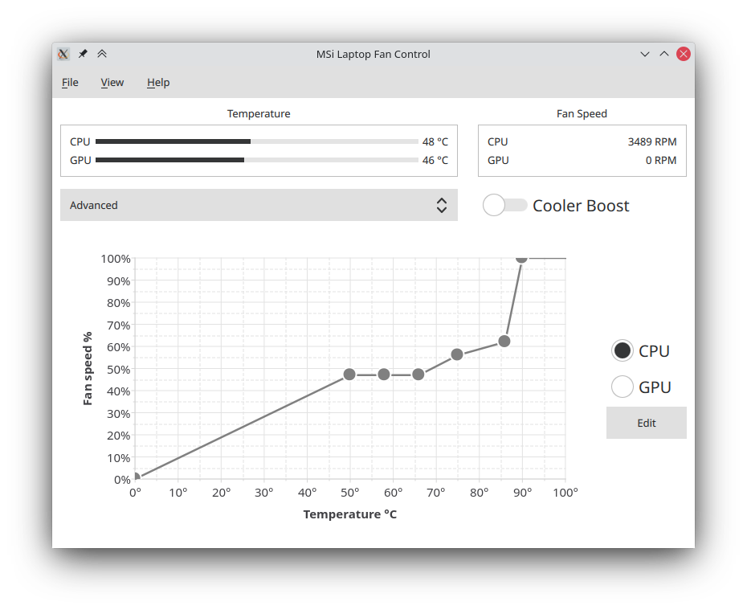

# MSI Laptop Fan Control

This is an attempt to create an analogue of MSI Dragon Center for OS GNU/Linux.
I am not a designer, so do not expect much.

The application is divided into two parts. Server and client.
The server part must work with root privileges to read/write to the file.
The server part only reads the data from the file. The client part works like a regular application.
Communication takes place using the dbus interface.



## Installation

I am testing on Ubuntu 20.04

### Dependencies

1. C++17 compiler
2. Qt, I am using 5.15.1
3. [Toml++](https://github.com/marzer/tomlplusplus)
4. [Magic Enum C++](https://github.com/Neargye/magic_enum)
5. [GoogleTest](https://github.com/google/googletest)
6. CMake

```modprobe ec_sys write_support=1```

### Compiling

```
git clone https://github.com/marshevms/mlfc.git
cd mlfc
mkdir build
cd build
cmake cmake -DCMAKE_BUILD_TYPE=Release ..
```

### Deploying

The client and server folders should appear in the build folder; they contain binary files. The name begins with mlfc_ [client | server]. Next, you need files from the dbus folder.

In com.github.mlfc.server.service should contain the path to the server.

Move files:
1. com.github.mlfc.server.service - /usr/share/dbus-1/system-services
2. com.github.mlfc.server.conf, com.github.mlfc.client.conf - /etc/dbus-1/system.d

## Thanks

https://github.com/YoyPa/isw -  for the documentation
